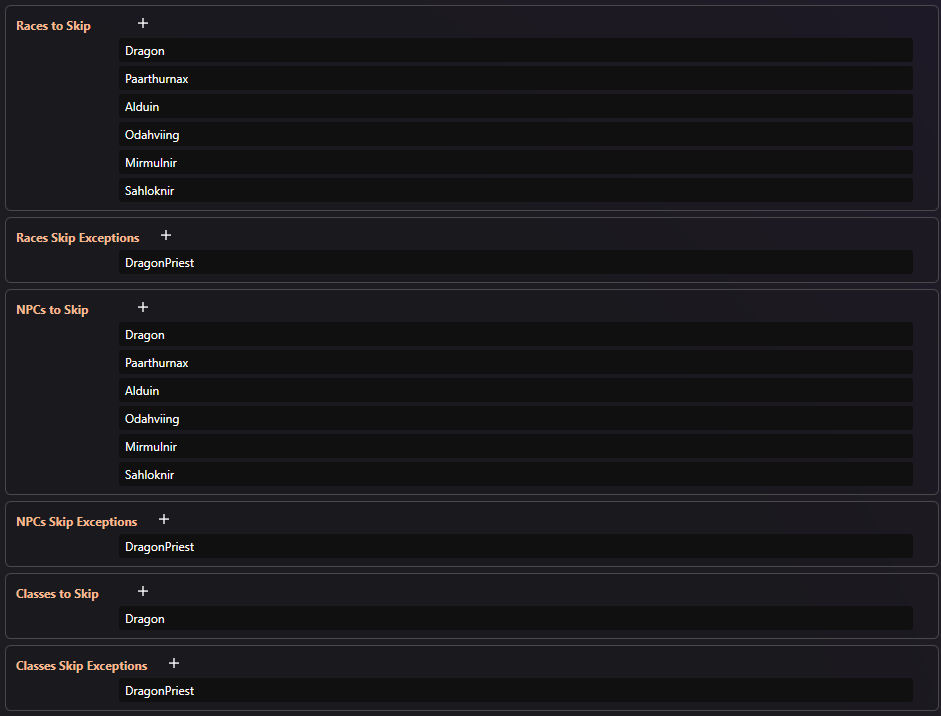

# NPC Stat Rescaler (Synthesis)

Synthesis port of **tjhm4**'s original zEdit mod:
[NPC Stat Rescaler on Nexus](https://www.nexusmods.com/skyrimspecialedition/mods/24254)

## What this fork is

- Original zEdit patcher author: **tjhm4**
- Original Synthesis conversion: **theSkyseS**
- This fork is meant to track the zEdit behavior from **v2.1.1 (2024-07-08)** and adds extra options on top.

Extra options in this fork:
- pattern-based skip/exceptions for races, NPCs, and classes
- Survival Mode checkbox (`Using Survival Mode?`)
- custom (*diversified*) playable race defaults (health/stamina/magicka/carry weight)

## Why this patcher exists

Vanilla Skyrim tends to overinflate NPC stats at higher levels.
This patcher gives direct control over the main stat systems so fights are less spongey and easier to tune to your load order.

## What gets patched

1. Race starting stats
2. Race regeneration rates
3. Class stat weights
4. NPC stat offsets
5. NPC bonus health per level (GMST)
6. Player combat regen penalties (GMST)

## Patch logic by system

### 1) Racial starting stats

For non-playable races (trolls, rabbits, etc.) the patcher applies:

`new stat = old stat * scale + shift`

Used settings:
- `Fallback Race Stats (Scale/Shift)` for Health/Stamina/Magicka

For playable races (Argonian, Nord, etc.) the patcher uses direct per-race values from:
- `Playable Race Base Stats`

Child and vampire race variants are then scaled using:
- `Child and Vampire Multipliers`

### 2) Class stat weights

`new weight = old weight * scale`

Used settings:
- `Class Stat Multipliers` (Health/Stamina/Magicka)

### 3) NPC offsets

`new offset = old offset * mult`

Used settings:
- `NPC Offset Multipliers`

Player offsets are always set to `0` by the patcher.

### 4) NPC bonus health per level

Used setting:
- `NPC Health Bonus Per Level` (`fNPCHealthLevelBonus`)

### 5) Race regen rates

`new rate = old rate * scale + shift`

Used settings:
- `Health Regen Settings`
- `Stamina Regen Settings`
- `Magicka Regen Settings`

For playable races, health regen control uses a hidden ability (`Playable Race Health Regen Debuff`) to avoid breaking multiplicative heal-rate effects.

**Vokrii** parity:
- `Scale Vokrii Additive Magicka Buffs` is disabled by default.
- When enabled, this patcher scales `VKR_Res_MagickaRecovery_Effect_Ab` magnitudes with `Magicka Regen Scale`, same idea as zEdit 2.1.1.

### 6) Player combat regen penalties

`regen in combat = base regen * penalty`

Used settings:
- `Player Combat Regen Penalties`
  - `fCombatHealthRegenRateMult`
  - `fCombatStaminaRegenRateMult`
  - `fCombatMagickaRegenRateMult`

## Filters (Skip + Exceptions)

Filtering is done by case-insensitive `EditorID` substring matching.

- `Races/NPCs/Classes to Skip`:
  matching records are not patched.
- `Races/NPCs/Classes Skip Exceptions`:
  if a record matches this, it is patched even when it also matches Skip.

You can enter:
- one pattern per entry
- or comma-separated patterns in one entry (example: `Dragon,Paarthurnax,Alduin`)

Example:
- Skip: `Dragon,Paarthurnax,Alduin`
- Exceptions: `DragonPriest`

Result:
- dragon entries are skipped
- `DragonPriest` is still patched

Here are my own settings:

This effectively replaces the old dedicated "edit dragons too?" toggle with a more general filter (works also for mod-added dragon npc/races as long as they contain the word `dragon` in their EditorID).

Tested with my favorite dragon setup:
>- **[Deadly Dragons](https://www.nexusmods.com/skyrimspecialedition/mods/23723)**
>- **[Dragon Races of Skyrim](https://www.nexusmods.com/skyrimspecialedition/mods/159377)**
>- **[Dragons Use Thu'um](https://www.nexusmods.com/skyrimspecialedition/mods/87085)**
>- **[Durnehviir Redone](https://www.nexusmods.com/skyrimspecialedition/mods/128325)**
>- **[Dreadful Alduin](https://www.nexusmods.com/skyrimspecialedition/mods/136437)**
>- **[Better Drain Vitality](https://www.nexusmods.com/skyrimspecialedition/mods/157933)**
>- **[Fire And Blood - Legendary Dragon Combats](https://www.nexusmods.com/skyrimspecialedition/mods/156018)**

### Sheogorath quest NPCs (legacy hardcoded skip in zEdit)

The original zEdit patcher hardcoded these two NPCs to skip:
- `dunBluePalacePelagiusSuspicious`
- `dunBluePalacePelagiusNightmare`

This fork does not hardcode them, on purpose.
The reason is that I wanted the patcher to have transparent behavior and be user-controlled instead of silently forcing record-level exceptions.

If you want exact legacy behavior, add both IDs to:
- `NPCs to Skip`

## Survival Mode

`Using Survival Mode?` changes two things:

1. adds `+100` carry weight to every patched race (*to account for the `-100` that Survival Mode applies to each race*)
2. forces `Playable Race Health Regen Debuff = 0`

That avoids the common Survival Mode issue where food-based regen effects stop working when multiple hidden debuffs stack (as described on the main mod page).

## Default playable race stats

| Race | Health | Stamina | Magicka | Carry Weight |
| --- | ---: | ---: | ---: | ---: |
| Argonian | 90 | 110 | 105 | 90 |
| Breton | 90 | 90 | 120 | 85 |
| Dark Elf (*Dunmer*) | 80 | 110 | 110 | 95 |
| High Elf (*Altmer*) | 75 | 75 | 150 | 85 |
| Imperial | 100 | 100 | 100 | 100 |
| Khajiit | 85 | 120 | 95 | 90 |
| Nord | 125 | 115 | 60 | 120 |
| Orc | 125 | 105 | 70 | 120 |
| Redguard | 90 | 120 | 90 | 120 |
| Wood Elf (*Bosmer*) | 85 | 110 | 105 | 85 |

All values are editable in Synthesis settings.

## Summary of changes compared to original ZEdit patcher

Compared to tjhm4's original ZEdit patcher, this version covers the same main systems and formulas, but  differs in a few places:

- dragon handling is now done through generic skip/exception filters (for better compatibility)
- Survival Mode checkbox is explicit
- race defaults are customized in this fork to offer more diversity
- class/NPC exclusion controls are broader than the original dragon-focused toggle
- Sheogorath quest NPC skip is configurable via `NPCs to Skip` instead of being hardcoded

## Credits

- Original zEdit patcher: **[tjhm4](https://www.nexusmods.com/profile/tjhm4)**
- Original Synthesis conversion: **[theSkyseS](https://github.com/theSkyseS)**
- Race stat defaults inspired by:
  - **[Diverse Racial Starting Stats SkyPatcher](https://www.nexusmods.com/skyrimspecialedition/mods/170051)** by [BlessignS91](https://www.nexusmods.com/profile/BlessingS91)
  - **[Rebalanced Carry Weight - SkyPatcher](https://www.nexusmods.com/skyrimspecialedition/mods/141332)** by [MrMoonSugar](https://www.nexusmods.com/profile/MrMoonSugar)
  - **[Weight A Minute - A No Race Edit Carry Weight Mod](https://www.nexusmods.com/skyrimspecialedition/mods/51821)** by [revenant0713](https://www.nexusmods.com/profile/revenant0713)
